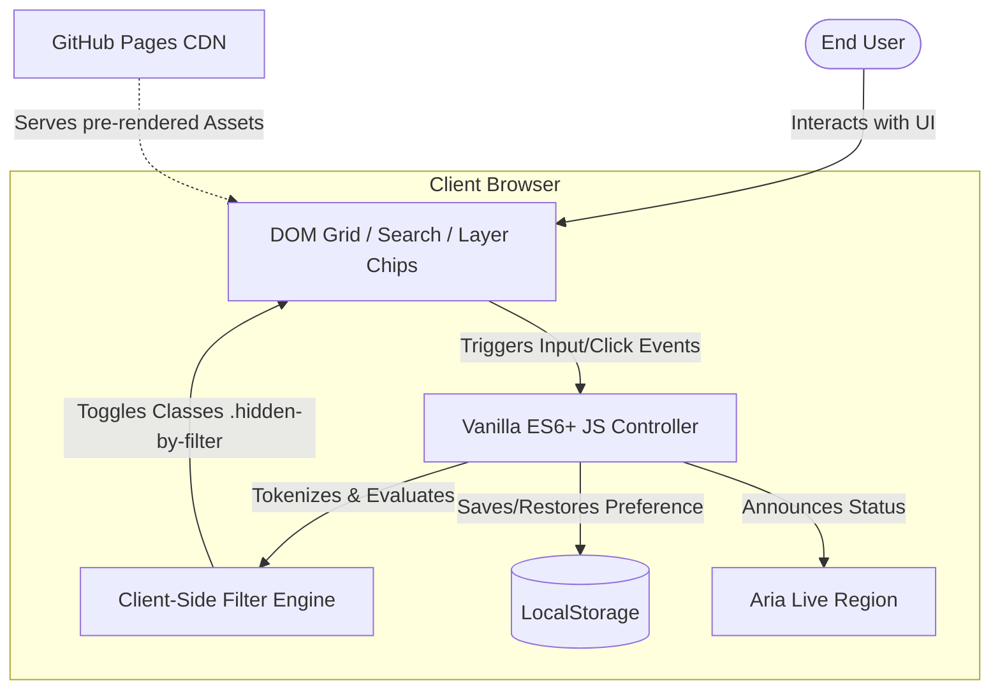

# ArchiMate 3.2 Mobile-First Cheat Sheet

**Live Page**: [unamatasanatarai.github.io/archimate-notations](https://unamatasanatarai.github.io/archimate-notations/)

A high-performance, lightweight, static web application providing enterprise architects with an instantaneous, searchable visual reference for ArchiMate 3.2 notations, layers, and structural concepts. 

Enterprise architects need rapid access to notation definitions and classifications during live modeling sessions. Standard reference documents are slow to load, difficult to navigate, and extremely hostile to mobile viewports. This project provides a zero-maintenance, zero-compute alternative optimized specifically for rapid mobile-first lookup and learning.

---

## Key Capabilities

- **Instant Event-Driven Substring Search**: Highly-optimized multi-token search matching across names, descriptions, and taxonomic tags in under 2ms.
- **Layer-Based Taxonomy Filtering**: Smooth, horizontal-scrollable carousel of filter chips matching the full ArchiMate 3.2 specification.
- **Pre-Rendered Static DOM Architecture**: Zero server dependencies, zero client-side database or API queries, and zero dynamic hydration cost for unmatched time-to-interactive.
- **Rule-of-Thumb Architectural Reference Matrix**: A high-visibility reference grid matching architecture layers to primary architectural questions and common elements, optimized for fast context checks.
- **Persistent Dual-Theme System**: Seamless transition between high-contrast dark and light themes with persistence backed by graceful degradation.
- **Rigorous WCAG 2.1 AA Accessibility Design**: Incorporates skip links, comprehensive keyboard focus state preservation, structural HTML5 landmark elements, ARIA-pressed states, and automated screen-reader updates via active live regions.

---

## Technical Approach & Architecture Decision Records (ADRs)

This application employs a lightweight, static client-side pattern, deliberately avoiding high-overhead Single Page Application (SPA) framework architectures to achieve maximum longevity, durability, and execution speed.

### ADR-01: Framework-Free Core Execution
- **Decision**: Implemented using Vanilla ES6+ JavaScript, CSS Custom Properties, and Semantic HTML5.
- **Rationale**: Eliminating dynamic framework runtimes (e.g., React, Vue) avoids compilation pipeline overhead, removes dependency vulnerability vectors, eliminates hydration delay, and results in a near-instant startup.

### ADR-02: Pre-Rendered Static DOM Strategy
- **Decision**: Pre-render all 71 notation elements directly inside the static HTML index file, using inline SVGs.
- **Rationale**: Allows search engines to fully index every card immediately for high-impact SEO discoverability, eliminates asynchronous runtime fetch operations, and avoids loading layouts on slow mobile networks.

### ADR-03: Performance-Optimized Client-Side Search
- **Decision**: Multi-token native substring filtering mapping live updates directly to visual CSS state triggers.
- **Rationale**: Because the dataset is stable (~71 cards), dynamic DOM state toggling using CSS visibility classes (e.g., `.hidden-by-filter`) delivers `< 2ms` filtering latency, outperforming runtime string tokenizers or full-text client-side engines.

---

## Architecture Overview

The application follows a clean single-tier static model. Data is stored directly inside the browser's DOM, enabling immediate manipulation by the Vanilla JS engine with zero network round-trips.

---

## Tech Stack

- **Languages**: HTML5, CSS3 (Custom Variables), JavaScript (ES6+), Python 3 (Offline code-generation tool)
- **Database / State Persistence**: HTML5 DOM dataset elements, Web LocalStorage API (Theme preference configuration)
- **Infrastructure & Hosting**: GitHub Pages CDN edge distribution

---

## Engineering Highlights & Performance Optimizations

- **Advanced Multi-Token Query Tokenizer**: The search engine features a safe custom prototype extension `tokenizeExpression` that splits user input by whitespace and ensures *all* typed tokens must match in any order across the element's name, description, or taxonomic tags.
- **State-Synchronized Deep Linking**: Full support for deep linking (`#business-actor`, `#rule-of-thumb-matrix`). On initial page load or popstate adjustments, the system parses the window hash, automatically resets filter states, updates active layer chips to ensure the card is visible, scrolls the target card smoothly to the viewport center, and shifts the keyboard focus to ensure perfect accessibility.
- **Asynchronous Clipboard Operations**: Permalink share button handles absolute path generation and dynamically writes clean URL paths into the system's clipboard using the asynchronous `navigator.clipboard` API with an automatic graceful fallback to mock text-range buffers for older rendering engines.
- **High-Performance Pills Scroll**: Smooth custom horizontal scrolling layout wrapper for layer chips, using responsive arrow buttons to slide the filter chip container cleanly by `150px` increments when touch swiping is unavailable.

---

## Development Process & Build Automation

Content is governed by an automated, offline compilation workflow that ensures zero runtime overhead:

1. **Source Dataset**: Content definitions, SVG assets, and meta-taxonomies are maintained inside a structured source file: `data.json`.
2. **Build Generation Utility**: A high-efficiency Python build script (`generate-cards.py`) parses the JSON dataset, converts textual names into stable, slugified URL anchors (e.g., `application-collaboration`), resolves internal layer CSS mappings, compiles inline SVG visual assets, and writes highly formatted, static HTML cards blocks directly to `cards-output.html.txt`.
3. **Static Integration**: The generated static layout block is merged into `index.html`, delivering a complete, optimized pre-rendered template ready for zero-hydration serving.

---

## Future Enhancements

- **ArchiMate 4.0 Migration Ready**: Designed to seamlessly accept updated taxonomy mappings inside `data.json` without modifying core structural UI layout, CSS grid frameworks, or searching controllers.
- **Export Capabilities**: Integration of client-side static print layouts to export cards as high-resolution printable reference documents or cheat-sheet cheat cards.
- **Interactive Quiz Sandbox**: An advanced learning-focused playground allowing certification candidates to test their knowledge by matching visual SVG notation representations to their respective layers and definitions.

---

## Summary

This project represents a professional-grade reference tool combining the simplicity of static delivery with modern interaction design. By avoiding unnecessary framework abstraction, prioritizing web accessibility standards, and employing offline build-time code generation, the application delivers a resilient reference experience that scales dynamically across all viewport classes.
